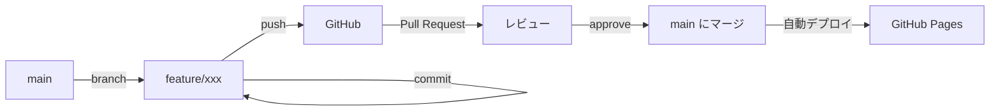

# GitHub 開発フロー・ブランチ戦略

このドキュメントは、GrowRepプロジェクトにおけるGitHub開発の原則とワークフローを定義します。
**GitHub Copilot および開発者は必ずこのルールに従ってください。**

---

## 📚 基本概念

### main ブランチ
- **役割**: 本番環境（GitHub Pages）に公開される最新の安定版コード
- **特徴**: 
  - 常にデプロイ可能な状態を保つ
  - 直接pushは原則禁止
  - バグのないコードのみがマージされる
- **保護ルール**: Pull Requestを経由してのみマージ可能

### feature ブランチ（開発ブランチ）
- **役割**: 新機能開発やバグ修正を行う作業用ブランチ
- **命名規則**: 
  - 新機能: `feature/機能名` （例: `feature/add-profile-image`）
  - バグ修正: `fix/バグ内容` （例: `fix/login-error`）
  - 改善: `improve/改善内容` （例: `improve/ui-ranking`）
  - ドキュメント: `docs/内容` （例: `docs/update-readme`）
- **特徴**: 
  - mainから分岐して作成
  - 作業完了後にPull Requestを作成
  - マージ後は削除

### Pull Request（PR）
- **役割**: コード変更をレビューし、mainブランチに統合するための申請
- **目的**: 
  - コード品質の維持
  - バグの早期発見
  - 知識の共有
  - 変更履歴の明確化

---

## 🔄 このプロジェクトでの開発フロー

### 基本フロー（通常の開発）



#### ステップ詳細

1. **ブランチ作成**
   ```bash
   # 最新のmainを取得
   git checkout main
   git pull origin main
   
   # 新しいブランチを作成
   git checkout -b feature/機能名
   ```

2. **開発・コミット**
   ```bash
   # 変更をステージング
   git add .
   
   # コミット（Conventional Commits形式）
   git commit -m "feat: 新機能の説明"
   ```

3. **プッシュ**
   ```bash
   git push origin feature/機能名
   ```

4. **Pull Request作成**
   - GitHubでPRを作成
   - タイトル: 変更内容を簡潔に
   - 説明: 何を変更したか、動作確認方法、注意点

5. **レビュー・マージ**
   - 自分でコードを再確認
   - 問題なければマージ
   - ブランチを削除

6. **確認**
   - GitHub Pagesで動作確認
   - 問題があればhotfixブランチで修正

---

## 📝 コミットメッセージ規約

### Conventional Commits形式

```
<type>: <subject>

<body>（オプション）
```

### Type一覧

| Type | 説明 | 例 |
|------|------|-----|
| `feat` | 新機能追加 | `feat: プロフィール画像機能を追加` |
| `fix` | バグ修正 | `fix: ログイン時のエラーを修正` |
| `improve` | 機能改善・UI改善 | `improve: ランキング表示を見やすく改善` |
| `refactor` | リファクタリング | `refactor: 投稿処理を関数に分離` |
| `style` | コードスタイル修正 | `style: インデントを統一` |
| `docs` | ドキュメント更新 | `docs: README にセットアップ手順を追加` |
| `test` | テスト追加・修正 | `test: 投稿機能のテストを追加` |
| `chore` | ビルド・設定変更 | `chore: .gitignore を更新` |

### コミットメッセージの例

✅ **良い例**
```bash
git commit -m "feat: 通知機能を追加"
git commit -m "fix: ランキングが正しく表示されない問題を修正"
git commit -m "improve: モバイル表示を最適化"
```

❌ **悪い例**
```bash
git commit -m "update"
git commit -m "修正"
git commit -m "いろいろ変更"
```

---

## 🚨 緊急修正（Hotfix）フロー

本番環境で重大なバグが見つかった場合の対応

```bash
# hotfixブランチを作成
git checkout main
git pull origin main
git checkout -b hotfix/バグ内容

# 修正・テスト
# ...

# コミット・プッシュ
git add .
git commit -m "fix: 緊急修正の説明"
git push origin hotfix/バグ内容

# PRを作成して即座にマージ
```

---

## 📋 Pull Request テンプレート

PRを作成する際は、以下の情報を含めてください：

```markdown
## 変更内容
<!-- 何を変更したか簡潔に -->

## 変更理由
<!-- なぜこの変更が必要か -->

## 動作確認
<!-- どのように動作確認したか -->
- [ ] ローカル環境で動作確認
- [ ] ブラウザのコンソールエラーなし
- [ ] 主要機能が正常に動作

## スクリーンショット（UI変更の場合）
<!-- 変更前後のスクリーンショット -->

## 注意事項
<!-- レビュアーに注意してほしい点 -->
```

---

## 🛡️ このプロジェクトの開発原則

### 1. Small Commits（小さいコミット）
- 1つのコミットで1つの変更を行う
- 「ついでに」修正しない
- レビューしやすいサイズを保つ

### 2. Frequent Pushes（頻繁なプッシュ）
- 作業の区切りごとにpush
- PCのクラッシュ対策
- 進捗の可視化

### 3. Self Review（セルフレビュー）
- PRを作成したら自分でコードを見直す
- GitHub上でdiffを確認
- 意図しない変更が含まれていないかチェック

### 4. Test Before Merge（マージ前のテスト）
- 必ずローカルで動作確認
- ブラウザのコンソールエラーを確認
- 主要機能が壊れていないか確認

### 5. Clean History（きれいな履歴）
- 意味のあるコミットメッセージ
- 論理的な変更単位
- 将来の自分や他の開発者が理解できる履歴

---

## 🎯 ブランチ運用ルール（このプロジェクト専用）

### 参加者が1人の場合（現状）

✅ **簡易フロー（推奨）**
```bash
# 機能追加ごとにブランチを作成
git checkout -b feature/xxx
# 開発・コミット
git push origin feature/xxx
# PRを作成してセルフレビュー後マージ
```

**メリット:**
- 変更履歴が明確
- 問題があればロールバック可能
- 良い習慣が身につく

✅ **超簡易フロー（緊急時のみ）**
```bash
# mainに直接commit（緊急修正のみ）
git add .
git commit -m "fix: 緊急修正"
git push origin main
```

**使用条件:**
- 本番環境が完全に動かない緊急事態
- 1行〜数行の軽微な修正
- すぐに動作確認できる変更

### 参加者が増えた場合

- 必ずPRを経由
- 最低1人のレビュワーが必要
- レビュー後のみマージ可能

---

## 🔧 便利なGitコマンド

### ブランチ管理
```bash
# 現在のブランチを確認
git branch

# リモートブランチを含めて確認
git branch -a

# ブランチを削除（マージ済み）
git branch -d feature/xxx

# ブランチを強制削除
git branch -D feature/xxx

# リモートブランチを削除
git push origin --delete feature/xxx
```

### 状態確認
```bash
# 変更状況を確認
git status

# コミット履歴を確認
git log --oneline

# 差分を確認
git diff
```

### やり直し
```bash
# 直前のコミットメッセージを修正
git commit --amend

# ステージングを取り消し
git reset HEAD <file>

# ファイルの変更を取り消し
git checkout -- <file>
```

---

## 📖 参考資料

- [Conventional Commits](https://www.conventionalcommits.org/)
- [GitHub Flow](https://docs.github.com/ja/get-started/quickstart/github-flow)
- [Pro Git Book](https://git-scm.com/book/ja/v2)

---

## 🤖 GitHub Copilot への指示

**GitHub Copilot がコードを生成する際は、以下を遵守してください：**

1. ✅ 変更は機能単位で小さく分割すること
2. ✅ コミットメッセージはConventional Commits形式を使用
3. ✅ 複数の無関係な変更を1つのコミットにまとめない
4. ✅ 破壊的変更の前に必ず警告を出す
5. ✅ セキュリティに関わる変更は特に慎重に

---

**最終更新**: 2026年1月24日  
**バージョン**: 1.0  
**ステータス**: アクティブ

このドキュメントは、プロジェクトの成長に合わせて更新されます。
